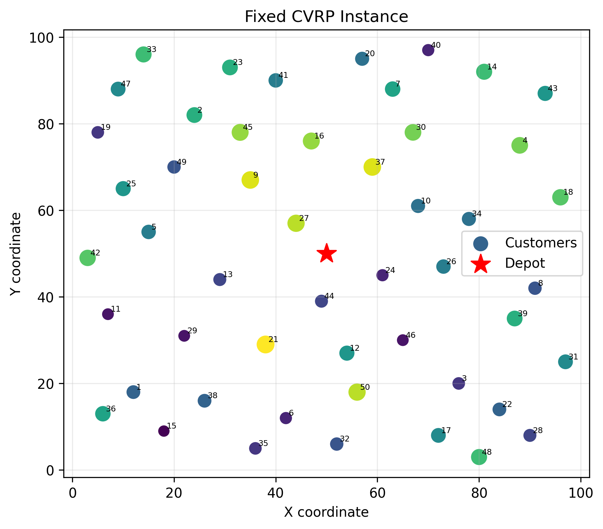
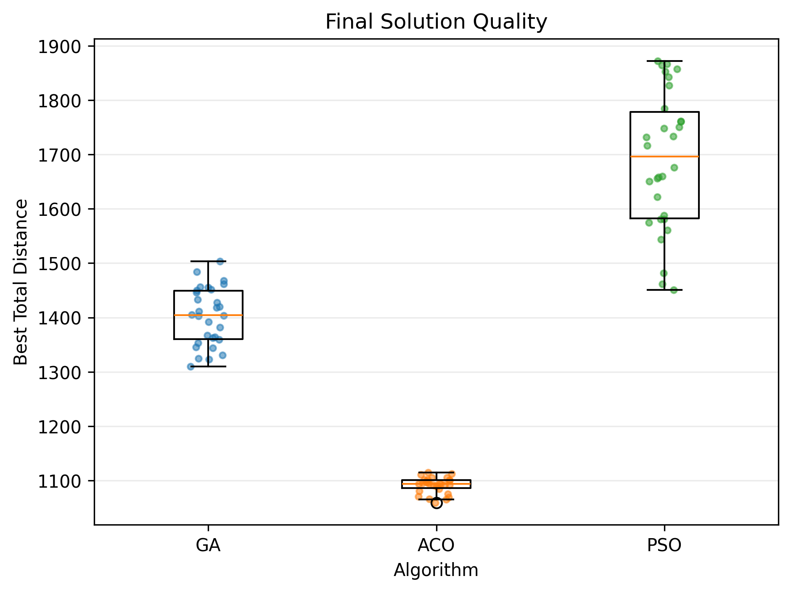
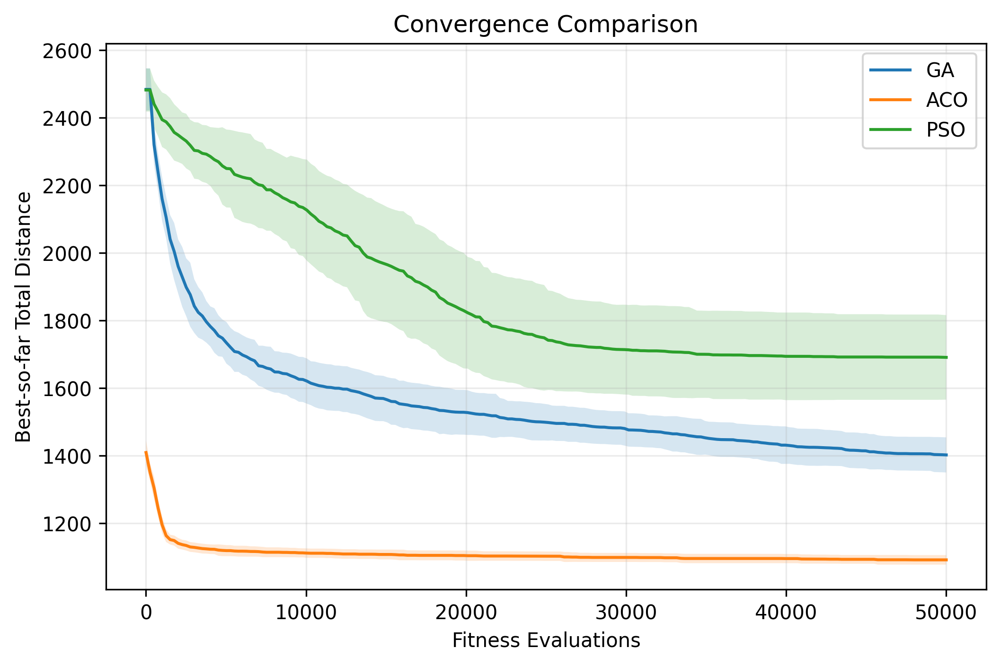
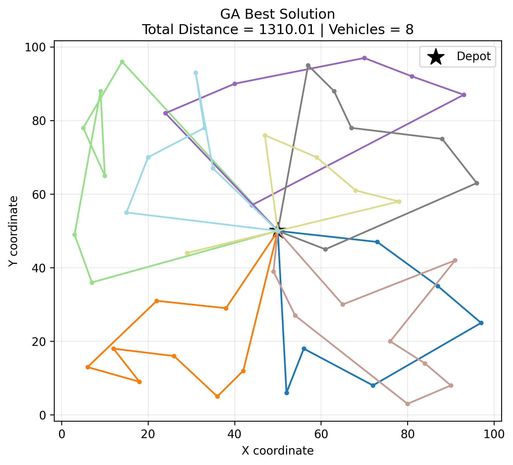
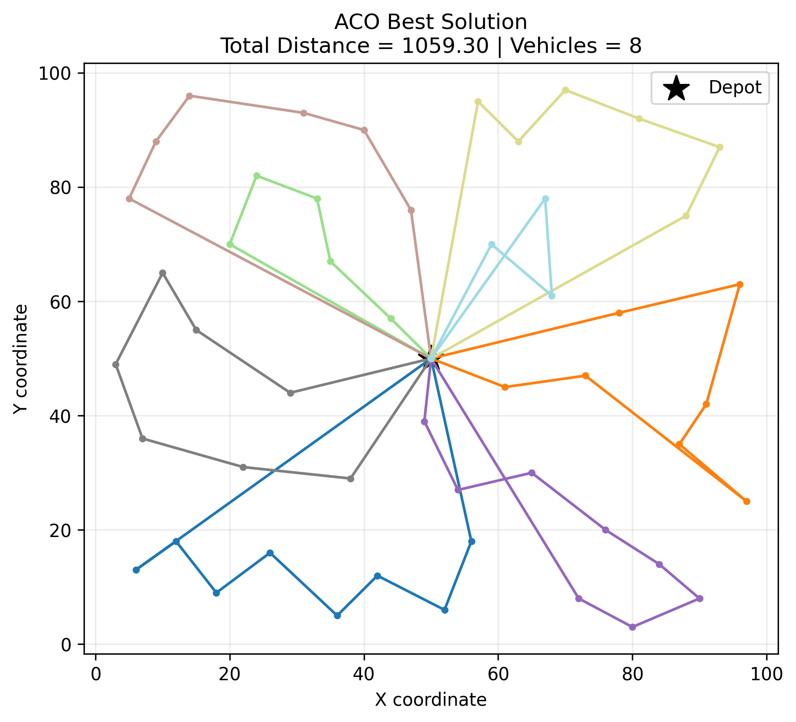
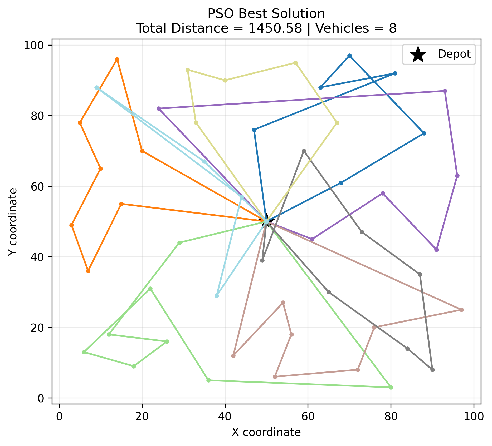
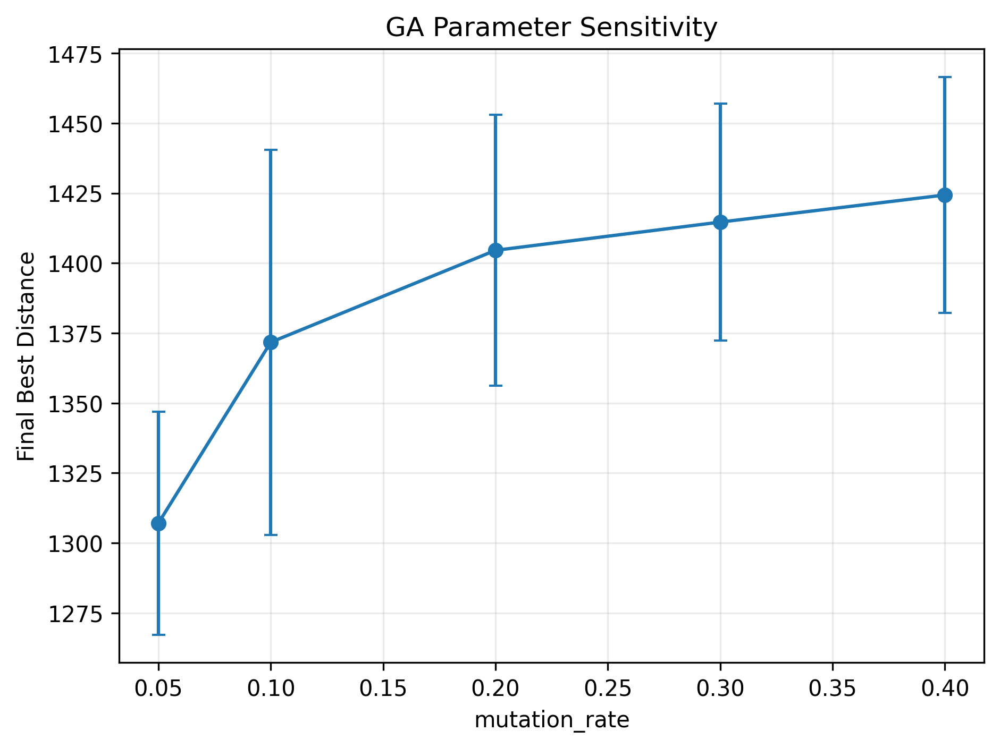

# 基于 GA、ACO 与 PSO 的容量约束车辆路径问题求解与性能比较

## 摘要

本文研究容量约束车辆路径问题（Capacitated Vehicle Routing Problem，CVRP），分别采用遗传算法（Genetic Algorithm，GA）、蚁群优化算法（Ant Colony Optimization，ACO）和粒子群优化算法（Particle Swarm Optimization，PSO）进行求解。为保证比较公平，三种算法在同一个固定的 50 客户实例上运行，并统一采用 50,000 次目标函数评价作为计算预算。每种算法使用随机种子 0–29 完成 30 次独立重复实验，以比较收敛速度、最终解质量、鲁棒性、车辆数和运行时间。实验结果表明，ACO 的平均最优距离为 1091.43，显著优于 GA 的 1401.91 和 PSO 的 1690.48；ACO 同时具有最小的标准差和最快的 90% 收敛速度。非参数统计检验表明三种算法之间的差异具有统计显著性。进一步的参数敏感性与留出验证发现，将 GA 的变异率由 0.20 降至 0.05，可使其平均距离改善 5.09%。实验说明，智能优化算法的性能不仅取决于搜索能力，还与解的表示方式、搜索空间结构以及算法所使用的先验信息密切相关。

**关键词：** 容量约束车辆路径问题；遗传算法；蚁群优化；粒子群优化；Random-Key；元启发式算法

## 1. 求解问题介绍

### 1.1 CVRP 问题描述

容量约束车辆路径问题是经典组合优化问题。给定一个配送中心、若干具有确定需求的客户以及一组容量相同的配送车辆，需要确定每辆车的访问路线，使所有客户均得到服务，同时使车辆总行驶距离最小。

本实验实例包含一个配送中心和 50 个客户。所有车辆均从配送中心出发，完成配送后返回配送中心，车辆容量为 100。每个客户必须且只能被访问一次，每条路线上的客户需求总量不得超过车辆容量。

节点之间采用欧氏距离：

$$
d_{ij}=\sqrt{(x_i-x_j)^2+(y_i-y_j)^2}。
$$

若车辆路线集合为 $R$，则优化目标为：

$$
\min f(R)=\sum_{r\in R}\sum_{k=1}^{|r|-1}d_{r_k,r_{k+1}}。
$$

约束条件包括：

1. 每个客户恰好被访问一次；
2. 每条路线以配送中心开始并以配送中心结束；
3. 每条路线上的总需求不超过车辆容量 100；
4. 最终解应覆盖全部 50 个客户，不允许客户重复或遗漏。

本实验固定使用 `data/cvrp_instance.csv` 中的实例。三种算法及所有随机重复均使用完全相同的坐标、需求和距离矩阵，从而消除问题实例差异造成的影响。

### 1.2 解的统一评价

GA 和 PSO 均使用“客户访问排列 + Split Decoder”的表示方式。解码器按照排列顺序依次将客户加入当前车辆；若加入下一个客户会使总需求超过容量，则结束当前路线并开启新路线。ACO 直接构造满足容量约束的车辆路线，但其最终总距离仍使用相同的距离计算函数。

统一评价方法保证三种算法最终优化的是同一个目标。程序还对每个最终解执行合法性检查，包括客户唯一访问、无遗漏、无重复、容量可行以及仓库首尾约束。

## 2. 所使用算法介绍

### 2.1 遗传算法

GA 将客户访问排列作为染色体，不包含配送中心。例如，染色体 `[4, 8, 1, 7, ...]` 表示客户访问的先后顺序。染色体经 Split Decoder 转换为多条车辆路线。

算法采用以下机制：

- 随机生成 100 个合法排列作为初始种群；
- 使用规模为 3 的锦标赛选择；
- 使用有序交叉（Ordered Crossover，OX）产生合法排列子代；
- 使用 inversion mutation 对染色体片段进行反转；
- 每代保留 2 个精英个体；
- 以总行驶距离作为适应度，距离越小越优。

GA 的探索能力来自随机初始化、交叉和变异，开发能力来自锦标赛选择和精英保留。OX 能够保证子代不出现客户重复或遗漏，但它主要保持排列的相对顺序，不一定能够稳定保留 CVRP 中真正重要的优质邻接边。

### 2.2 蚁群优化算法

ACO 直接在节点之间的边上维护信息素 $\tau_{ij}$，并使用距离倒数作为启发信息：

$$
\eta_{ij}=\frac{1}{d_{ij}}。
$$

蚂蚁从配送中心出发，在未访问且满足剩余容量的客户中，按照以下概率选择下一个节点：

$$
P_{ij}=\frac{\tau_{ij}^{\alpha}\eta_{ij}^{\beta}}
{\sum_{k\in allowed}\tau_{ik}^{\alpha}\eta_{ik}^{\beta}}。
$$

若当前车辆无法继续访问任何客户，则车辆返回配送中心并开启新路线。每轮结束后，信息素以 $\rho=0.3$ 的比例挥发，并通过全部蚂蚁及全局最优解进行增强。正式参数为蚂蚁数 50、$\alpha=1$、$\beta=3$。

ACO 的概率路径构造和信息素挥发提供探索能力，信息素增强和距离启发式提供开发能力。与 GA 和 PSO 不同，ACO 学习的是“哪些节点之间适合相连”，与路径优化问题的边组合结构直接对应。

### 2.3 Random-Key 粒子群优化算法

标准 PSO 面向连续空间，而 CVRP 是排列组合问题。为保留标准 PSO 的速度和位置更新公式，本实验采用 Random-Key Encoding。每个粒子的位置为 50 维连续向量，通过 `argsort` 得到客户访问排列，再由 Split Decoder 生成车辆路线。

粒子速度和位置按以下公式更新：

$$
v_i(t+1)=w(t)v_i(t)+c_1r_1(pbest_i-x_i(t))+c_2r_2(gbest-x_i(t)),
$$

$$
x_i(t+1)=x_i(t)+v_i(t+1)。
$$

惯性权重从 0.9 线性递减至 0.4，$c_1=c_2=1.5$，粒子数为 100。较大的早期惯性促进全局探索，后期较小的惯性配合个体最优和全局最优吸引实现局部开发。

Random-Key 的优点是实现简单且可直接使用标准连续 PSO，但连续位置空间中的欧氏距离与排列空间中的路线相似度并不完全一致。两个数值非常接近的 key 发生次序交换时，解码后的客户顺序就会离散变化，这是 PSO 在该问题上的潜在表示瓶颈。

## 3. 实验流程与设置

实验流程如下：

1. 从固定 CSV 加载 50 客户 CVRP 实例并建立距离矩阵；
2. 使用相同实例分别运行 GA、ACO 和 PSO；
3. 每种算法采用 seeds 0–29 进行 30 次独立重复；
4. 每次运行最多进行 50,000 次目标函数评价；
5. 保存每次运行的最优距离、路线、车辆数、评价次数、运行时间和收敛历史；
6. 对 30 次最终距离计算均值、标准差、中位数、最小值、最大值和 IQR；
7. 将不同算法的 best-so-far 历史按统一评价网格进行前值插值，绘制均值与标准差收敛曲线；
8. 使用 Kruskal–Wallis 检验比较三组结果；若总体显著，则进行两两 Mann–Whitney U 检验，并使用 Benjamini–Hochberg 方法校正 p 值；
9. 分别对 GA 的变异率、ACO 的 $\beta$ 和 PSO 的末期惯性权重进行参数敏感性实验；
10. 使用 seeds 10–29 对敏感性实验选出的候选参数进行独立留出验证。

主实验参数如下表所示。

| 算法 | 主要参数 |
|---|---|
| GA | population=100，tournament=3，crossover=0.9，mutation=0.20，elite=2 |
| ACO | ants=50，alpha=1，beta=3，rho=0.3，q=1 |
| PSO | swarm=100，w=0.9→0.4，c1=1.5，c2=1.5 |

采用目标函数评价次数而不是迭代次数作为统一预算，是因为一次 GA 迭代评价约 100 个个体，一次 ACO 迭代评价 50 只蚂蚁，一次 PSO 迭代评价 100 个粒子。若仅令三种算法运行相同迭代次数，其实际计算预算并不相同。

## 4. 实验结果

### 4.1 最终解质量与鲁棒性

30 次正式实验的描述性统计如下。

| 算法 | Mean | Std | Median | Min | Max | IQR | 平均运行时间/s |
|---|---:|---:|---:|---:|---:|---:|---:|
| GA | 1401.91 | 52.83 | 1404.36 | 1310.01 | 1503.33 | 89.32 | 4.57 |
| ACO | 1091.43 | 14.39 | 1094.05 | 1059.30 | 1114.73 | 14.80 | 98.97 |
| PSO | 1690.48 | 127.27 | 1696.25 | 1450.58 | 1872.25 | 195.84 | 5.52 |

ACO 的平均距离比 GA 低 22.15%，比 PSO 低 35.44%。ACO 的标准差和 IQR 也最小，说明其结果对随机初始化最不敏感。PSO 的标准差为 127.27，约为 ACO 的 8.85 倍，表现出明显的随机波动。

GA 和 ACO 的 30 个最终解均使用 8 辆车；PSO 平均使用 8.2 辆车，车辆数在 8–9 之间变化。虽然这些 PSO 解都满足容量约束，但车辆数变化进一步说明其解码排列不够稳定。

箱型图显示 ACO 的分布集中且整体低于另外两种算法；GA 的离散程度适中；PSO 的箱体和须最长，原始散点分布范围也最广。ACO 的最差结果 1114.73 仍优于 GA 的最好结果 1310.01，说明两者在当前实验设置下存在非常清晰的性能间隔。

### 4.2 收敛速度

图中横轴为 fitness evaluations，纵轴为 30 次运行的 best-so-far 总距离；实线表示均值，半透明区域表示均值上下一个标准差。

| 算法 | 平均 90% 收敛评价次数 | 中位数 | 标准差 |
|---|---:|---:|---:|
| GA | 22033 | 21800 | 8613 |
| ACO | 7063 | 3675 | 9461 |
| PSO | 22783 | 21900 | 5929 |

ACO 在实验初期快速降低总距离，典型运行约在 3675 次评价时已达到总改进量的 90%。其均值高于中位数，说明少量运行在后期仍有较长时间的改善。GA 前期下降明显，之后持续缓慢改善，说明它能够保持一定搜索多样性，但对高质量边结构的学习效率弱于 ACO。PSO 的下降速度最慢，约在 30,000–40,000 次评价后进入明显平台，且标准差阴影始终较宽。

### 4.3 统计显著性

Kruskal–Wallis 检验结果为 $H=77.9945$，$p=1.158\times10^{-17}$，说明三种算法的最终距离总体上存在显著差异。

| 两两比较 | Mann–Whitney U | BH 校正后 p 值 |
|---|---:|---:|
| GA vs ACO | 900.0 | $4.530\times10^{-11}$ |
| GA vs PSO | 13.0 | $1.094\times10^{-10}$ |
| ACO vs PSO | 0.0 | $4.530\times10^{-11}$ |

三组两两差异均显著，因此 ACO、GA 和 PSO 的最终排序并非由少数异常运行造成，而是在 30 次独立实验上得到统计支持。

### 4.4 最佳路线

三种算法 30 次运行中的最佳路线如下。

| GA | ACO | PSO |
|---|---|---|
|  |  |  |

ACO 路线在空间上呈现更清晰的局部聚集，较少出现长距离交叉和跨区域往返。GA 的路线结构次之，而 PSO 路线中更容易出现空间上相距较远的客户被连续访问。

## 5. 实验分析

### 5.1 ACO 为何表现最好

ACO 的主要优势来自搜索表示与 CVRP 结构的高度匹配。CVRP 的目标由路线中相邻节点之间的边距离决定，因此真正重要的信息是“客户 $i$ 与客户 $j$ 是否应相邻”。ACO 的信息素矩阵恰好直接记录边 $(i,j)$ 的历史质量。优秀解中反复出现的短边会获得更多信息素，使后续蚂蚁更可能复用这些邻接关系。

此外，启发函数 $1/d_{ij}$ 将空间距离显式加入状态转移概率。在搜索初期信息素尚未形成时，算法仍可依靠距离启发式产生明显优于随机排列的路线；随着迭代继续，信息素逐步学习仅靠最近邻规则无法表达的全局组合结构。因此，ACO 同时具备问题特定先验和经验学习能力，这解释了其初期下降快、最终距离低的现象。

ACO 还在构造过程中直接过滤超过剩余容量的客户，使每一步都处于可行搜索空间。GA 和 PSO 虽然也能通过 Split Decoder 得到可行解，但其搜索操作作用于完整客户排列，并没有显式感知车辆容量边界。排列中的一次变化可能改变后续多个客户的车辆分组，而 ACO 在构造路线时能够实时利用剩余容量信息。

### 5.2 GA 为何居中及其优化原因

GA 的排列表示与 CVRP 基本兼容，交叉和变异均能产生合法客户顺序，因此其性能明显优于 PSO。但 OX 主要保持客户的相对顺序，并不保证父代中的优质边被完整继承。CVRP 对邻接边非常敏感，一个看似合理的排列片段经过 Split Decoder 后还可能因容量边界变化而被分配到不同车辆。

敏感性实验中 mutation_rate=0.05 的平均距离为 1307.11，而默认 0.20 为 1404.58。留出 seeds 10–29 的验证中，0.05 平均改善 58.26，20 次中胜 16 次，单侧 Wilcoxon $p=0.000508$。合并 30 个实际运行后，优化 GA 的均值由 1401.91 降至 1330.58，改善 5.09%，30 次中胜 25 次，配对检验 $p=3.997\times10^{-6}$。

该结果表明默认 0.20 对 inversion mutation 偏高。较高变异率虽然增强探索，却会频繁反转较长排列片段，破坏已经形成的优质邻接边。降低至 0.05 后，交叉和初始种群仍提供搜索多样性，而较少的变异更有利于保留已发现的路线结构。这是探索与开发平衡改善的结果。

### 5.3 PSO 为何表现较弱

PSO 的主要问题不是标准连续 PSO 更新公式本身，而是连续表示与排列问题之间的结构不匹配。粒子的 pbest、gbest 和速度均定义在连续欧氏空间中，但 CVRP 解质量取决于排序后的邻接关系。连续向量发生很小变化时，两个 random key 可能交换相对大小，使解码排列产生离散变化；反之，连续空间中距离较大的两个向量也可能具有相同排序。

因此，PSO 的速度方向并不总能对应“保留或增加优质路线边”的方向。粒子受到 gbest 吸引时，虽然连续位置逐渐接近，但其路线结构未必平滑改善。随着粒子逐渐聚集，连续多样性下降，而排序后的离散路线仍可能停留在质量较差的邻域，从而出现后期平台和较大随机波动。

PSO 的 w_end 参数从 0.2 到 0.6 的整体敏感性检验不显著（Kruskal–Wallis $p=0.950$）。候选 0.6 在留出集仅胜 10/20，说明简单调整惯性权重无法解决根本的表示问题。若进一步改进 PSO，更合理的方向是加入面向边的局部搜索、重新排序操作或离散邻域机制，而不是继续微调连续参数。

### 5.4 ACO 的代价与结果适用范围

ACO 平均单次运行时间为 98.97 秒，明显高于 GA 和 PSO。这是因为每只蚂蚁构造解时，需要逐客户计算可行集合和转移概率，并在每轮更新信息素矩阵。相同的 objective evaluation budget 保证了解质量和收敛速度比较的公平性，但并不代表三种算法具有相同的实际计算开销。

因此，若应用场景非常重视实时性，GA 可能在质量和时间之间提供更均衡的选择；若更重视最终路线质量，当前 ACO 更有优势。运行时间还受到硬件、Python 实现和并行调度影响，应作为辅助指标而不是主要结论。

同时，本实验只使用一个固定实例。固定实例保证了算法对比的内部公平性，但不能证明 ACO 在所有 CVRP 规模、需求分布和空间布局上都占优。根据 No Free Lunch 思想，当前结论应表述为：ACO 的边表示和距离启发式与本实验 CVRP 结构更匹配，而非 ACO 普遍优于 GA 和 PSO。

## 6. 结论

在固定 50 客户 CVRP 实例、30 次独立运行和相同 50,000 次目标函数评价预算下，ACO 在最终解质量、鲁棒性和收敛速度方面均表现最好；GA 表现居中，并可通过降低变异率得到显著改善；Random-Key PSO 的表现最弱，主要原因是连续粒子空间与离散路线排列空间之间存在表示不匹配。

实验验证了算法表示与问题结构匹配的重要性。ACO 直接学习路线边并显式利用距离和容量信息，因此能够快速形成高质量路线；GA 可以有效搜索客户排列，但交叉和变异未直接针对路线边；PSO 虽通过 Random-Key 完成连续到排列的映射，但标准速度更新无法稳定反映路线邻域结构。最终结果说明，智能优化算法的性能不仅由全局搜索能力决定，也与解的编码、搜索空间几何结构和问题先验信息密切相关。

本实验建议在后续研究中增加不同规模和不同需求分布的 CVRPLIB 实例，并考虑为 GA 加入边保持交叉或局部搜索、为 ACO设计候选列表与信息素上下界、为 PSO 引入排列空间局部搜索，以进一步验证算法性能及泛化能力。
